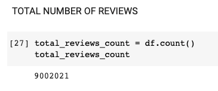

# Amazon_Vine_Analysis

## Overview of the Analysis
I was tasked with analyzing Amazon reviews written by members of the paid Amazon Vine program. The Amazon Vine program is a service that allows manufacturers and publishers to receive reviews for their products. 

Companies pay a small fee to Amazon and provide products to Amazon Vine members, who are then required to publish a review. I utilized PySpark and SQL to determine if there is any bias toward favorable reviews from Vine members in your dataset.

## Results

Total Reviews

### How many Vine reviews and non-Vine reviews were there?

* The wireless dataset had a total of __613__ vine (paid) reviews

* The wireless dataset had a total of __64968__ no-vine (unpaid) reviews

### How many Vine reviews were 5 stars? How many non-Vine reviews were 5 stars?

* The wireless dataset had a total of __222__ vine (paid) 5-star reviews

* The wireless dataset had a total of __30543__ no-vine (unpaid) 5-star reviews

### What percentage of Vine reviews were 5 stars? What percentage of non-Vine reviews were 5 stars?

* __36.22%__ of the Vine reviews were 5-stars

* __47.01%__ of the non-Vine reviews were 5-stars

## Summary
From our analysis, there is not a bias towards the Vine (paid) reviews. From the 613 paid reviews only 222 were 5-star which is around 36%. There were more unpaid reviews and a higher percentage of those reviews were 5-star. Hence, it is not worth to pay for the reviews. There is no bias. 

An additional analysis would be to seprate the different products and see how the vine reviews affect different wireless products. Some wireless devices might be more susceptible to advertising and paid reviews.
